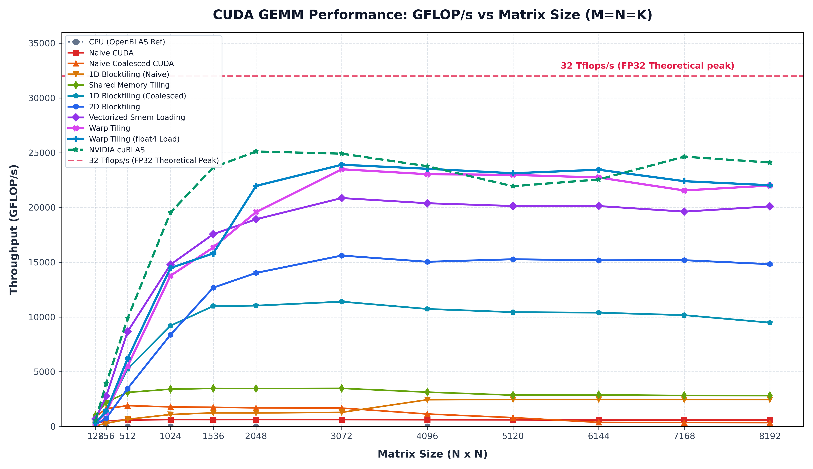
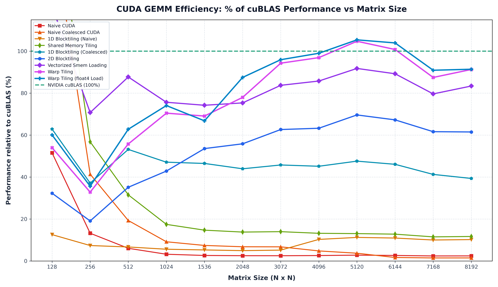
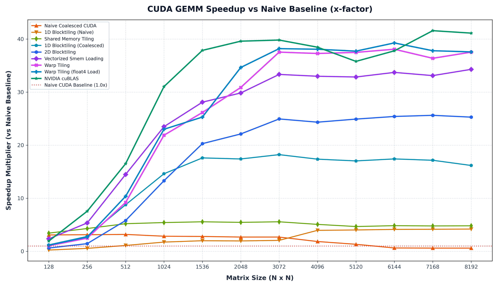

# CUDA GEMM Benchmarks & Optimizations

An iterative optimization study of **General Matrix Multiplication (GEMM)** in CUDA, comparing progressive CUDA kernel implementations against CPU (OpenBLAS verified) and NVIDIA **cuBLAS** performance.

---

## Overview

Matrix multiplication ($C = A \times B$) is the foundational computational kernel for deep learning and high-performance computing. This project benchmarks and analyzes key optimization techniques on GPUs:

1. **CPU Baseline** (`src/cpu.cpp`): Triple-nested loop CPU reference.
2. **Naive CUDA Kernel** (`src/naive.cu`): Baseline 2D grid implementation without coalescing.
3. **Coalesced Memory Access** (`src/naive_coalescing.cu`): Optimizing global memory access patterns to align with GPU warp read transactions.
4. **Shared Memory Tiling** (`src/smem_caching.cu`): Block-level caching in shared memory ($16 \times 16$ tile size) to drastically reduce global memory bandwidth bottleneck.
5. **1D Block Tiling (Naive)** (`src/1d_blocktiling_naive.cu`): Thread-level 1D register tiling ($4 \times 1$ per thread work allocation) with shared memory caching, but uncoalesced global memory loads.
6. **1D Block Tiling (Coalesced)** (`src/1d_blocktiling_coalescing.cu`): Combining 1D thread block tiling with coalesced global memory transfers to drastically improve arithmetic intensity and bandwidth efficiency.
7. **2D Block Tiling** (`src/2d_blocktiling.cu`): 2D register tiling ($4 \times 4$ output tile per thread) paired with shared memory caching ($64 \times 64$ block tiles) to maximize register reuse and memory bandwidth utilization.
8. **Vectorized Shared Memory Loading** (`src/vectorized_smem_loading.cu`): Vectorized memory loads (`float4` / 128-bit vector transfers) combined with 2D block tiling ($8 \times 8$ output tile per thread) to maximize memory transaction width and instruction throughput.
9. **Warp Tiling** (`src/wraptiling.cu`): Hierarchical block-to-warp tiling breakdown ($128 \times 128$ block tiles divided into $64 \times 32$ warp tiles and thread sub-sections) with padded shared memory layouts to prevent bank conflicts and optimize register reuse.
10. **Warp Tiling with Vectorized Register Loading** (`src/wraptiling_float4_load.cu`): Combining hierarchical warp-level tiling with `float4` (128-bit) vector loads from shared memory into registers for maximum throughput and memory pipeline efficiency.
11. **NVIDIA cuBLAS** (`src/cublas.cu`): Production-grade vendor library performance benchmark (`cublasSgemm`).

All implementations compute $C = A \times B$ for square single-precision floating-point matrices ($M = K = N$) and automatically validate their output against OpenBLAS `cblas_sgemm` to verify floating-point precision correctness.

---

## Performance Summary

Throughput is measured in **GFLOP/s** ($\text{Floating Point Operations per Second}$), calculated as:

$$\text{GFLOP/s} = \frac{2 \times M \times K \times N}{\text{Time (seconds)} \times 10^9}$$

### Hardware & Benchmark Environment

All benchmarks were recorded on the following system:

- **GPU**: NVIDIA GeForce RTX 5080 Laptop / Mobile (Max-Q)
- **VRAM**: 16 GB
- **FP32 Theoretical Limits**: 27.6 TFLOP/s (1800 MHz) | 35.1 TFLOP/s (2285 MHz max boost)
- **CPU**: Intel® Core™ Ultra 9 275HX (24 cores)
- **OS & Kernel**: Ubuntu 26.04 LTS x86_64 (Linux kernel 7.0.0-29-generic)
- **Memory**: 32 GB RAM

---

### Comparative Benchmark Results

| Matrix Size ($M \times K \times N$) | CPU<br>(OpenBLAS Ref) | Naive<br>CUDA | Naive Coalesced<br>CUDA | Shared Memory<br>(2D Tile) | 1D Blocktiling<br>(Naive) | 1D Blocktiling<br>(Coalesced) | 2D Blocktiling | Vectorized<br>Smem Loading | Warp Tiling | Warp Tiling<br>(float4 Load) | NVIDIA<br>cuBLAS |
| :--- | :---: | :---: | :---: | :---: | :---: | :---: | :---: | :---: | :---: | :---: | :---: |
| **$128 \times 128 \times 128$** | 1.50&nbsp;GFLOP/s<br>*(2.791 ms)* | 290.50&nbsp;GFLOP/s<br>*(0.0144 ms)* | 896.53&nbsp;GFLOP/s<br>*(0.0047 ms)* | **996.75&nbsp;GFLOP/s**<br>*(0.0042 ms)* | 70.85&nbsp;GFLOP/s<br>*(0.0592 ms)* | 354.34&nbsp;GFLOP/s<br>*(0.0118 ms)* | 182.02&nbsp;GFLOP/s<br>*(0.0230 ms)* | 683.73&nbsp;GFLOP/s<br>*(0.0061 ms)* | 304.11&nbsp;GFLOP/s<br>*(0.0138 ms)* | 338.51&nbsp;GFLOP/s<br>*(0.0124 ms)* | 563.39&nbsp;GFLOP/s<br>*(0.0074 ms)* |
| **$256 \times 256 \times 256$** | 2.40&nbsp;GFLOP/s<br>*(13.95 ms)* | 518.05&nbsp;GFLOP/s<br>*(0.0648 ms)* | 1619.92&nbsp;GFLOP/s<br>*(0.0207 ms)* | 2224.39&nbsp;GFLOP/s<br>*(0.0151 ms)* | 288.63&nbsp;GFLOP/s<br>*(0.1163 ms)* | 1453.13&nbsp;GFLOP/s<br>*(0.0231 ms)* | 747.54&nbsp;GFLOP/s<br>*(0.0449 ms)* | 2769.61&nbsp;GFLOP/s<br>*(0.0121 ms)* | 1284.70&nbsp;GFLOP/s<br>*(0.0261 ms)* | 1394.94&nbsp;GFLOP/s<br>*(0.0241 ms)* | **3914.79&nbsp;GFLOP/s**<br>*(0.0086 ms)* |
| **$512 \times 512 \times 512$** | 2.34&nbsp;GFLOP/s<br>*(114.62 ms)* | 598.33&nbsp;GFLOP/s<br>*(0.4486 ms)* | 1907.59&nbsp;GFLOP/s<br>*(0.1407 ms)* | 3114.74&nbsp;GFLOP/s<br>*(0.0862 ms)* | 660.70&nbsp;GFLOP/s<br>*(0.4063 ms)* | 5253.06&nbsp;GFLOP/s<br>*(0.0511 ms)* | 3470.67&nbsp;GFLOP/s<br>*(0.0773 ms)* | 8664.13&nbsp;GFLOP/s<br>*(0.0310 ms)* | 5508.67&nbsp;GFLOP/s<br>*(0.0487 ms)* | 6202.76&nbsp;GFLOP/s<br>*(0.0433 ms)* | **9878.25&nbsp;GFLOP/s**<br>*(0.0272 ms)* |
| **$1024 \times 1024 \times 1024$** | 1.45&nbsp;GFLOP/s<br>*(1478.30 ms)* | 629.19&nbsp;GFLOP/s<br>*(3.413 ms)* | 1790.38&nbsp;GFLOP/s<br>*(1.199 ms)* | 3409.50&nbsp;GFLOP/s<br>*(0.6299 ms)* | 1096.03&nbsp;GFLOP/s<br>*(1.959 ms)* | 9199.04&nbsp;GFLOP/s<br>*(0.2334 ms)* | 8371.03&nbsp;GFLOP/s<br>*(0.2565 ms)* | 14776.16&nbsp;GFLOP/s<br>*(0.1453 ms)* | 13762.25&nbsp;GFLOP/s<br>*(0.1560 ms)* | 14469.67&nbsp;GFLOP/s<br>*(0.1484 ms)* | **19531.39&nbsp;GFLOP/s**<br>*(0.1100 ms)* |
| **$1536 \times 1536 \times 1536$** | N/A | 624.91&nbsp;GFLOP/s<br>*(11.60 ms)* | 1754.26&nbsp;GFLOP/s<br>*(4.132 ms)* | 3477.32&nbsp;GFLOP/s<br>*(2.084 ms)* | 1247.43&nbsp;GFLOP/s<br>*(5.810 ms)* | 10999.58&nbsp;GFLOP/s<br>*(0.6589 ms)* | 12676.93&nbsp;GFLOP/s<br>*(0.5717 ms)* | 17560.55&nbsp;GFLOP/s<br>*(0.4127 ms)* | 16345.10&nbsp;GFLOP/s<br>*(0.4434 ms)* | 15806.47&nbsp;GFLOP/s<br>*(0.4585 ms)* | **23658.88&nbsp;GFLOP/s**<br>*(0.3063 ms)* |
| **$2048 \times 2048 \times 2048$** | 0.81&nbsp;GFLOP/s<br>*(21298.78 ms)* | 634.17&nbsp;GFLOP/s<br>*(27.09 ms)* | 1704.18&nbsp;GFLOP/s<br>*(10.08 ms)* | 3461.89&nbsp;GFLOP/s<br>*(4.963 ms)* | 1241.12&nbsp;GFLOP/s<br>*(13.84 ms)* | 11035.80&nbsp;GFLOP/s<br>*(1.557 ms)* | 14024.03&nbsp;GFLOP/s<br>*(1.225 ms)* | 18921.56&nbsp;GFLOP/s<br>*(0.9080 ms)* | 19580.47&nbsp;GFLOP/s<br>*(0.8774 ms)* | 21968.60&nbsp;GFLOP/s<br>*(0.7820 ms)* | **25109.43&nbsp;GFLOP/s**<br>*(0.6842 ms)* |
| **$3072 \times 3072 \times 3072$** | N/A | 625.80&nbsp;GFLOP/s<br>*(92.65 ms)* | 1681.39&nbsp;GFLOP/s<br>*(34.48 ms)* | 3483.43&nbsp;GFLOP/s<br>*(16.65 ms)* | 1292.73&nbsp;GFLOP/s<br>*(44.85 ms)* | 11400.32&nbsp;GFLOP/s<br>*(5.086 ms)* | 15608.78&nbsp;GFLOP/s<br>*(3.715 ms)* | 20858.68&nbsp;GFLOP/s<br>*(2.780 ms)* | 23487.18&nbsp;GFLOP/s<br>*(2.469 ms)* | 23899.39&nbsp;GFLOP/s<br>*(2.426 ms)* | **24910.63&nbsp;GFLOP/s**<br>*(2.328 ms)* |
| **$4096 \times 4096 \times 4096$** | 0.35&nbsp;GFLOP/s<br>*(395621.22 ms)* | 618.04&nbsp;GFLOP/s<br>*(222.38 ms)* | 1141.97&nbsp;GFLOP/s<br>*(120.35 ms)* | 3137.69&nbsp;GFLOP/s<br>*(43.80 ms)* | 2445.89&nbsp;GFLOP/s<br>*(56.19 ms)* | 10731.95&nbsp;GFLOP/s<br>*(12.81 ms)* | 15038.57&nbsp;GFLOP/s<br>*(9.139 ms)* | 20386.18&nbsp;GFLOP/s<br>*(6.742 ms)* | 23036.76&nbsp;GFLOP/s<br>*(5.966 ms)* | 23531.41&nbsp;GFLOP/s<br>*(5.841 ms)* | **23767.92&nbsp;GFLOP/s**<br>*(5.783 ms)* |
| **$5120 \times 5120 \times 5120$** | N/A | 612.99&nbsp;GFLOP/s<br>*(437.91 ms)* | 813.93&nbsp;GFLOP/s<br>*(329.80 ms)* | 2864.40&nbsp;GFLOP/s<br>*(93.71 ms)* | 2465.67&nbsp;GFLOP/s<br>*(108.87 ms)* | 10440.92&nbsp;GFLOP/s<br>*(25.71 ms)* | 15271.35&nbsp;GFLOP/s<br>*(17.58 ms)* | 20133.12&nbsp;GFLOP/s<br>*(13.33 ms)* | 22975.97&nbsp;GFLOP/s<br>*(11.68 ms)* | **23121.64&nbsp;GFLOP/s**<br>*(11.61 ms)* | 21937.06&nbsp;GFLOP/s<br>*(12.24 ms)* |
| **$6144 \times 6144 \times 6144$** | N/A | 597.11&nbsp;GFLOP/s<br>*(776.83 ms)* | 377.41&nbsp;GFLOP/s<br>*(1229.04 ms)* | 2886.51&nbsp;GFLOP/s<br>*(160.70 ms)* | 2467.69&nbsp;GFLOP/s<br>*(187.97 ms)* | 10395.17&nbsp;GFLOP/s<br>*(44.62 ms)* | 15172.37&nbsp;GFLOP/s<br>*(30.57 ms)* | 20129.13&nbsp;GFLOP/s<br>*(23.04 ms)* | 22736.80&nbsp;GFLOP/s<br>*(20.40 ms)* | **23445.19&nbsp;GFLOP/s**<br>*(19.78 ms)* | 22556.10&nbsp;GFLOP/s<br>*(20.56 ms)* |
| **$7168 \times 7168 \times 7168$** | N/A | 592.61&nbsp;GFLOP/s<br>*(1242.94 ms)* | 359.22&nbsp;GFLOP/s<br>*(2050.52 ms)* | 2834.12&nbsp;GFLOP/s<br>*(259.90 ms)* | 2465.44&nbsp;GFLOP/s<br>*(298.76 ms)* | 10167.61&nbsp;GFLOP/s<br>*(72.44 ms)* | 15184.47&nbsp;GFLOP/s<br>*(48.51 ms)* | 19620.01&nbsp;GFLOP/s<br>*(37.54 ms)* | 21551.92&nbsp;GFLOP/s<br>*(34.18 ms)* | 22398.62&nbsp;GFLOP/s<br>*(32.89 ms)* | **24636.33&nbsp;GFLOP/s**<br>*(29.90 ms)* |
| **$8192 \times 8192 \times 8192$** | N/A | 586.25&nbsp;GFLOP/s<br>*(1875.51 ms)* | 353.86&nbsp;GFLOP/s<br>*(3107.22 ms)* | 2818.42&nbsp;GFLOP/s<br>*(390.12 ms)* | 2460.43&nbsp;GFLOP/s<br>*(446.88 ms)* | 9483.42&nbsp;GFLOP/s<br>*(115.94 ms)* | 14822.64&nbsp;GFLOP/s<br>*(74.18 ms)* | 20100.01&nbsp;GFLOP/s<br>*(54.70 ms)* | 22000.86&nbsp;GFLOP/s<br>*(49.98 ms)* | 22029.10&nbsp;GFLOP/s<br>*(49.91 ms)* | **24102.57&nbsp;GFLOP/s**<br>*(45.62 ms)* |

> All GPU benchmarks report **PASS** with maximum absolute numerical error bounded under $7.1 \times 10^{-4}$ against OpenBLAS reference outputs.

### Benchmark Visualizations & Charts







---

## Performance Analysis & Insights

### $2048 \times 2048 \times 2048$ Matrix Performance Breakdown

| Implementation | Execution Time | Throughput | Performance vs. cuBLAS (%) |
| :--- | :---: | :---: | :---: |
| **CPU (OpenBLAS Ref)** | 21298.78 ms | 0.81 GFLOP/s | 0.00% |
| **Naive CUDA** | 27.090 ms | 634.17 GFLOP/s | 2.53% |
| **Naive Coalesced CUDA** | 10.081 ms | 1704.18 GFLOP/s | 6.79% |
| **1D Block Tiling (Naive)** | 13.842 ms | 1241.12 GFLOP/s | 4.94% |
| **Shared Memory (Smem) Tiled** | 4.963 ms | 3461.89 GFLOP/s | 13.79% |
| **1D Block Tiling (Coalesced)** | 1.557 ms | 11035.80 GFLOP/s | 43.95% |
| **2D Block Tiling** | 1.225 ms | 14024.03 GFLOP/s | 55.85% |
| **Vectorized Smem Loading** | 0.908 ms | 18921.56 GFLOP/s | 75.36% |
| **Warp Tiling** | 0.877 ms | 19580.47 GFLOP/s | 77.98% |
| **Warp Tiling (float4 Load)** | 0.782 ms | 21968.60 GFLOP/s | **87.49%** |
| **NVIDIA cuBLAS** | 0.684 ms | 25109.43 GFLOP/s | **100.00%** |

### $4096 \times 4096 \times 4096$ Matrix Performance Breakdown

| Implementation | Execution Time | Throughput | Performance vs. cuBLAS (%) |
| :--- | :---: | :---: | :---: |
| **CPU (OpenBLAS Ref)** | 395621.22 ms | 0.35 GFLOP/s | 0.00% |
| **Naive CUDA** | 222.378 ms | 618.04 GFLOP/s | 2.60% |
| **Naive Coalesced CUDA** | 120.352 ms | 1141.97 GFLOP/s | 4.80% |
| **1D Block Tiling (Naive)** | 56.192 ms | 2445.89 GFLOP/s | 10.29% |
| **Shared Memory (Smem) Tiled** | 43.803 ms | 3137.69 GFLOP/s | 13.20% |
| **1D Block Tiling (Coalesced)** | 12.807 ms | 10731.95 GFLOP/s | 45.15% |
| **2D Block Tiling** | 9.139 ms | 15038.57 GFLOP/s | 63.27% |
| **Vectorized Smem Loading** | 6.742 ms | 20386.18 GFLOP/s | 85.77% |
| **Warp Tiling** | 5.966 ms | 23036.76 GFLOP/s | 96.92% |
| **Warp Tiling (float4 Load)** | 5.841 ms | 23531.41 GFLOP/s | **99.00%** |
| **NVIDIA cuBLAS** | 5.783 ms | 23767.92 GFLOP/s | **100.00%** |

### $8192 \times 8192 \times 8192$ Matrix Performance Breakdown

| Implementation | Execution Time | Throughput | Performance vs. cuBLAS (%) |
| :--- | :---: | :---: | :---: |
| **Naive CUDA** | 1875.51 ms | 586.25 GFLOP/s | 2.43% |
| **Naive Coalesced CUDA** | 3107.22 ms | 353.86 GFLOP/s | 1.47% |
| **1D Block Tiling (Naive)** | 446.88 ms | 2460.43 GFLOP/s | 10.21% |
| **Shared Memory (Smem) Tiled** | 390.12 ms | 2818.42 GFLOP/s | 11.69% |
| **1D Block Tiling (Coalesced)** | 115.94 ms | 9483.42 GFLOP/s | 39.35% |
| **2D Block Tiling** | 74.18 ms | 14822.64 GFLOP/s | 61.50% |
| **Vectorized Smem Loading** | 54.70 ms | 20100.01 GFLOP/s | 83.39% |
| **Warp Tiling** | 49.98 ms | 22000.86 GFLOP/s | 91.28% |
| **Warp Tiling (float4 Load)** | 49.91 ms | 22029.10 GFLOP/s | **91.40%** |
| **NVIDIA cuBLAS** | 45.62 ms | 24102.57 GFLOP/s | **100.00%** |

1. **CPU vs GPU Baseline**: Even the naive uncoalesced CUDA kernel achieves a **~780x speedup** over single-threaded C++ GEMM at $2048 \times 2048$ matrix size due to massive parallel execution across GPU cores.
2. **Coalesced Memory Access**: Reordering memory indexing to align contiguous thread accesses within a warp yields a **~2.69x speedup** over naive indexing at $2048 \times 2048$, resolving unaligned memory transactions.
3. **Shared Memory Tiling (2D Tile)**: By loading $16 \times 16$ matrix tiles into high-speed `__shared__` memory and synchronizing threads (`__syncthreads()`), global memory traffic is reduced by a factor of 16. This increases throughput from **1704.18 GFLOP/s** (Coalesced) to **3461.89 GFLOP/s** (Shared Memory)—a **2.03x improvement**.
4. **1D Block Tiling & Register Reuse**: Assigning multiple output elements to each thread's register space significantly improves arithmetic intensity. When paired with coalesced global memory loads (`1d_blocktiling_coalescing.cu`), performance reaches **11035.80 GFLOP/s** (11.03 TFLOP/s)—a **3.19x speedup** over 2D Shared Memory Tiling and reaching **43.95% of cuBLAS performance**.
5. **2D Block Tiling (2D Thread/Register Tiling)**: Extending register caching into two dimensions ($4 \times 4$ per-thread tile) alongside 2D shared memory caching (`src/2d_blocktiling.cu`) reuses cached values across both rows and columns. This boosts performance to **14024.03 GFLOP/s** (14.02 TFLOP/s) at $2048 \times 2048$—achieving **55.85% of cuBLAS performance**.
6. **Vectorized Shared Memory Loading**: Utilizing 128-bit vector instructions (`float4` loads and stores) combined with expanded 2D block tiling ($8 \times 8$ per-thread tile) maximizes global and shared memory transaction efficiency. At $2048 \times 2048$, throughput reaches **18921.56 GFLOP/s** (**75.36% of cuBLAS**), and at $4096 \times 4096$, it reaches **20386.18 GFLOP/s** (**85.77% of cuBLAS**).
7. **Warp Tiling**: Dividing thread blocks into warp-level execution tiles ($64 \times 32$ warp tiles within $128 \times 128$ block tiles) and incorporating padded shared memory layouts drastically reduces bank conflicts and thread synchronization stalls. At $2048 \times 2048$, performance jumps to **19580.47 GFLOP/s** (**77.98% of cuBLAS**), and at $4096 \times 4096$ to **23036.76 GFLOP/s** (**96.92% of cuBLAS**).
8. **Warp Tiling with Vectorized Register Loading**: Vectorizing shared-memory-to-register reads using `float4` (128-bit) access patterns further optimizes register pressure and memory instruction pipeline throughput. At $4096 \times 4096$, performance reaches **23531.41 GFLOP/s** (**99.00% of cuBLAS**), virtually matching vendor-optimized cuBLAS performance!
9. **cuBLAS Peak Performance**: cuBLAS reaches **25.11 TFLOP/s** throughput at $2048 \times 2048$ and **24.10 TFLOP/s** at $8192 \times 8192$. It achieves this level by leveraging hardware-level features such as 2D thread tiling, vectorized memory operations (`float4`), warp shuffle instructions, double buffering/pipelining, and hardware Tensor Cores.

---

## Project Structure

```
cuda-gemm/
├── benchmarks/                             # Pre-computed benchmark execution logs & plots
│   ├── 1d_blocktiling_benchmark.txt        # Benchmark log for 1D Blocktiling implementations
│   ├── 2d_blocktiling_benchmark.txt        # Benchmark log for 2D Blocktiling implementation
│   ├── cpu_benchmark.txt                   # CPU reference benchmark log
│   ├── cublas_benchmark.txt                # cuBLAS benchmark log
│   ├── cublas_percentage_vs_matrix_size.png# Relative cuBLAS performance (%) plot
│   ├── execution_time_vs_matrix_size.png   # Execution time (ms) log-scale plot
│   ├── gflops_vs_matrix_size.png           # GFLOP/s vs Matrix Size plot (equal spacing)
│   ├── gflops_vs_matrix_size_scaled.png    # GFLOP/s vs Matrix Size plot (linear scale)
│   ├── naive_benchmark.txt                 # Uncoalesced CUDA kernel log
│   ├── naive_coalescing_benchmark.txt      # Coalesced CUDA kernel log
│   ├── smem_benchmark.txt                  # Shared memory tiling log
│   ├── speedup_vs_naive.png                # Speedup relative to naive CUDA baseline plot
│   ├── vectorized_smem_loading_benchmark.txt # Vectorized shared memory loading log
│   ├── wraptiling_benchmark.txt            # Warp Tiling kernel log
│   └── wraptiling_float4_load_benchmark.txt # Warp Tiling with float4 load kernel log
├── src/                                    # Source implementations
│   ├── 1d_blocktiling_coalescing.cu        # 1D blocktiling CUDA kernel with coalesced loads
│   ├── 1d_blocktiling_naive.cu             # 1D blocktiling CUDA kernel (uncoalesced)
│   ├── 2d_blocktiling.cu                   # 2D blocktiling CUDA kernel (4x4 thread tiling)
│   ├── cpu.cpp                             # CPU OpenBLAS reference & GEMM baseline
│   ├── cublas.cu                           # cuBLAS benchmark
│   ├── naive.cu                            # Uncoalesced CUDA kernel
│   ├── naive_coalescing.cu                 # Memory-coalesced CUDA kernel
│   ├── smem_caching.cu                     # Tiled Shared Memory CUDA kernel
│   ├── vectorized_smem_loading.cu          # Vectorized shared memory loading (float4) CUDA kernel
│   ├── wraptiling.cu                       # Warp Tiling CUDA kernel
│   └── wraptiling_float4_load.cu           # Warp Tiling with float4 loading CUDA kernel
├── generate_plot.py                        # Benchmark visualization plotting script
└── README.md                               # Project documentation
```

---

## Detailed Benchmark Reports

Individual execution logs are stored in the [`benchmarks/`](./benchmarks/) folder:

- [`benchmarks/cpu_benchmark.txt`](./benchmarks/cpu_benchmark.txt)
- [`benchmarks/naive_benchmark.txt`](./benchmarks/naive_benchmark.txt)
- [`benchmarks/naive_coalescing_benchmark.txt`](./benchmarks/naive_coalescing_benchmark.txt)
- [`benchmarks/smem_benchmark.txt`](./benchmarks/smem_benchmark.txt)
- [`benchmarks/1d_blocktiling_benchmark.txt`](./benchmarks/1d_blocktiling_benchmark.txt)
- [`benchmarks/2d_blocktiling_benchmark.txt`](./benchmarks/2d_blocktiling_benchmark.txt)
- [`benchmarks/vectorized_smem_loading_benchmark.txt`](./benchmarks/vectorized_smem_loading_benchmark.txt)
- [`benchmarks/wraptiling_benchmark.txt`](./benchmarks/wraptiling_benchmark.txt)
- [`benchmarks/wraptiling_float4_load_benchmark.txt`](./benchmarks/wraptiling_float4_load_benchmark.txt)
- [`benchmarks/cublas_benchmark.txt`](./benchmarks/cublas_benchmark.txt)

---

## Acknowledgments

- Concepts and optimization steps were inspired by Simon Boehm's excellent guide: [How to Optimize a CUDA Matmul Kernel for cuBLAS-like Performance](https://siboehm.com/articles/22/CUDA-MMM). All implementations in this repository were written from scratch.
