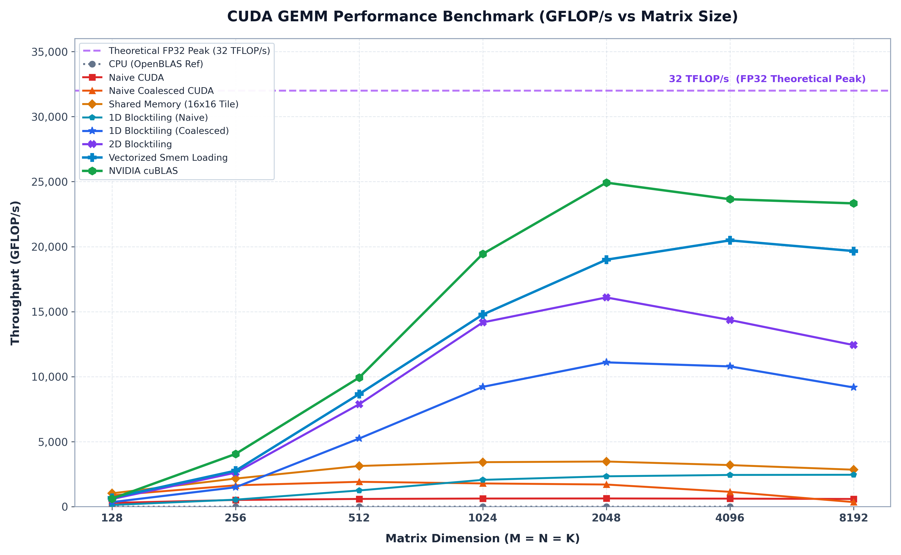

# CUDA GEMM Benchmarks & Optimizations

An iterative optimization study of **General Matrix Multiplication (GEMM)** in CUDA, comparing progressive CUDA kernel implementations against CPU (OpenBLAS verified) and NVIDIA **cuBLAS** performance.

---

## Overview

Matrix multiplication ($C = A \times B$) is the foundational computational kernel for deep learning and high-performance computing. This project benchmarks and analyzes key optimization techniques on GPUs:

1. **CPU Baseline** (`src/cpu.cpp`): Triple-nested loop CPU reference.
2. **Naive CUDA Kernel** (`src/naive.cu`): Baseline 2D grid implementation without coalescing.
3. **Coalesced Memory Access** (`src/naive_coalescing.cu`): Optimizing global memory access patterns to align with GPU warp read transactions.
4. **Shared Memory Tiling** (`src/smem_caching.cu`): Block-level caching in shared memory ($16 \times 16$ tile size) to drastically reduce global memory bandwidth bottleneck.
5. **1D Block Tiling (Naive)** (`src/1d_blocktiling_naive.cu`): Thread-level 1D register tiling ($4 \times 1$ per thread work allocation) with shared memory caching, but uncoalesced global memory loads.
6. **1D Block Tiling (Coalesced)** (`src/1d_blocktiling_coalescing.cu`): Combining 1D thread block tiling with coalesced global memory transfers to drastically improve arithmetic intensity and bandwidth efficiency.
7. **2D Block Tiling** (`src/2d_blocktiling.cu`): 2D register tiling ($4 \times 4$ output tile per thread) paired with shared memory caching ($64 \times 64$ block tiles) to maximize register reuse and memory bandwidth utilization.
8. **Vectorized Shared Memory Loading** (`src/vectorized_smem_loading.cu`): Vectorized memory loads (`float4` / 128-bit vector transfers) combined with 2D block tiling ($8 \times 8$ output tile per thread) to maximize memory transaction width and instruction throughput.
9. **NVIDIA cuBLAS** (`src/cublas.cu`): Production-grade vendor library performance benchmark (`cublasSgemm`).

All implementations compute $C = A \times B$ for square single-precision floating-point matrices ($M = K = N$) and automatically validate their output against OpenBLAS `cblas_sgemm` to verify floating-point precision correctness.

---

## Performance Summary

Throughput is measured in **GFLOP/s** ($\text{Floating Point Operations per Second}$), calculated as:

$$\text{GFLOP/s} = \frac{2 \times M \times K \times N}{\text{Time (seconds)} \times 10^9}$$

### Hardware & Benchmark Environment

All benchmarks were recorded on the following system:

- **GPU**: NVIDIA GeForce RTX 5080 Laptop / Mobile (Max-Q)
- **VRAM**: 16 GB
- **FP32 Theoretical Limits**: 27.6 TFLOP/s (1800 MHz) | 35.1 TFLOP/s (2285 MHz max boost)
- **CPU**: Intel® Core™ Ultra 9 275HX (24 cores)
- **OS & Kernel**: Ubuntu 26.04 LTS x86_64 (Linux kernel 7.0.0-29-generic)
- **Memory**: 32 GB RAM

---

### Comparative Benchmark Results

| Matrix Size ($M \times K \times N$) | CPU<br>(OpenBLAS Ref) | Naive<br>CUDA | Naive Coalesced<br>CUDA | Shared Memory<br>(2D Tile) | 1D Blocktiling<br>(Naive) | 1D Blocktiling<br>(Coalesced) | 2D Blocktiling | Vectorized<br>Smem Loading | NVIDIA<br>cuBLAS |
| :--- | :---: | :---: | :---: | :---: | :---: | :---: | :---: | :---: | :---: |
| **$128 \times 128 \times 128$** | 1.50&nbsp;GFLOP/s<br>*(2.79 ms)* | 293.29&nbsp;GFLOP/s<br>*(0.0143 ms)* | 869.75&nbsp;GFLOP/s<br>*(0.0048 ms)* | **1030.44&nbsp;GFLOP/s**<br>*(0.0041 ms)* | 132.72&nbsp;GFLOP/s<br>*(0.0316 ms)* | 351.68&nbsp;GFLOP/s<br>*(0.0119 ms)* | 589.35&nbsp;GFLOP/s<br>*(0.0071 ms)* | 683.73&nbsp;GFLOP/s<br>*(0.0061 ms)* | 614.50&nbsp;GFLOP/s<br>*(0.0068 ms)* |
| **$256 \times 256 \times 256$** | 2.40&nbsp;GFLOP/s<br>*(13.95 ms)* | 518.87&nbsp;GFLOP/s<br>*(0.0647 ms)* | 1644.83&nbsp;GFLOP/s<br>*(0.0204 ms)* | 2164.69&nbsp;GFLOP/s<br>*(0.0155 ms)* | 542.57&nbsp;GFLOP/s<br>*(0.0618 ms)* | 1494.98&nbsp;GFLOP/s<br>*(0.0224 ms)* | 2619.48&nbsp;GFLOP/s<br>*(0.0128 ms)* | 2769.61&nbsp;GFLOP/s<br>*(0.0121 ms)* | **4057.17&nbsp;GFLOP/s**<br>*(0.0083 ms)* |
| **$512 \times 512 \times 512$** | 2.34&nbsp;GFLOP/s<br>*(114.62 ms)* | 598.12&nbsp;GFLOP/s<br>*(0.4488 ms)* | 1915.34&nbsp;GFLOP/s<br>*(0.1402 ms)* | 3132.30&nbsp;GFLOP/s<br>*(0.0857 ms)* | 1249.44&nbsp;GFLOP/s<br>*(0.2148 ms)* | 5243.86&nbsp;GFLOP/s<br>*(0.0512 ms)* | 7879.59&nbsp;GFLOP/s<br>*(0.0341 ms)* | 8664.13&nbsp;GFLOP/s<br>*(0.0310 ms)* | **9928.52&nbsp;GFLOP/s**<br>*(0.0270 ms)* |
| **$1024 \times 1024 \times 1024$** | 1.45&nbsp;GFLOP/s<br>*(1478.30 ms)* | 629.16&nbsp;GFLOP/s<br>*(3.413 ms)* | 1790.41&nbsp;GFLOP/s<br>*(1.199 ms)* | 3425.44&nbsp;GFLOP/s<br>*(0.6269 ms)* | 2065.08&nbsp;GFLOP/s<br>*(1.040 ms)* | 9217.36&nbsp;GFLOP/s<br>*(0.2330 ms)* | 14173.54&nbsp;GFLOP/s<br>*(0.1515 ms)* | 14776.16&nbsp;GFLOP/s<br>*(0.1453 ms)* | **19440.29&nbsp;GFLOP/s**<br>*(0.1105 ms)* |
| **$2048 \times 2048 \times 2048$** | 0.81&nbsp;GFLOP/s<br>*(21298.78 ms)* | 634.46&nbsp;GFLOP/s<br>*(27.08 ms)* | 1706.15&nbsp;GFLOP/s<br>*(10.07 ms)* | 3476.63&nbsp;GFLOP/s<br>*(4.942 ms)* | 2337.99&nbsp;GFLOP/s<br>*(7.348 ms)* | 11101.55&nbsp;GFLOP/s<br>*(1.548 ms)* | 16093.69&nbsp;GFLOP/s<br>*(1.067 ms)* | **18996.48&nbsp;GFLOP/s**<br>*(0.9044 ms)* | **24924.54&nbsp;GFLOP/s**<br>*(0.6893 ms)* |
| **$4096 \times 4096 \times 4096$** | 0.35&nbsp;GFLOP/s<br>*(395621.22 ms)* | 621.23&nbsp;GFLOP/s<br>*(221.24 ms)* | 1145.32&nbsp;GFLOP/s<br>*(120.00 ms)* | 3201.09&nbsp;GFLOP/s<br>*(42.94 ms)* | 2442.67&nbsp;GFLOP/s<br>*(56.27 ms)* | 10790.70&nbsp;GFLOP/s<br>*(12.74 ms)* | 14359.50&nbsp;GFLOP/s<br>*(9.571 ms)* | **20483.71&nbsp;GFLOP/s**<br>*(6.710 ms)* | **23648.83&nbsp;GFLOP/s**<br>*(5.812 ms)* |
| **$8192 \times 8192 \times 8192$** | N/A | 595.95&nbsp;GFLOP/s<br>*(1844.98 ms)* | 354.47&nbsp;GFLOP/s<br>*(3101.83 ms)* | 2846.37&nbsp;GFLOP/s<br>*(386.29 ms)* | 2456.85&nbsp;GFLOP/s<br>*(447.53 ms)* | 9172.77&nbsp;GFLOP/s<br>*(119.87 ms)* | 12432.11&nbsp;GFLOP/s<br>*(88.44 ms)* | **19663.92&nbsp;GFLOP/s**<br>*(55.92 ms)* | **23328.82&nbsp;GFLOP/s**<br>*(47.13 ms)* |

> All GPU benchmarks report **PASS** with maximum absolute numerical error bounded under $7.1 \times 10^{-4}$ against OpenBLAS reference outputs.

### GFLOP/s vs. Matrix Size Chart



---

## Performance Analysis & Insights

### $2048 \times 2048 \times 2048$ Matrix Performance Breakdown

| Implementation | Execution Time | Throughput | Performance vs. cuBLAS (%) |
| :--- | :---: | :---: | :---: |
| **CPU (OpenBLAS Ref)** | 21298.78 ms | 0.81 GFLOP/s | 0.003% |
| **Naive CUDA** | 27.08 ms | 634.46 GFLOP/s | 2.55% |
| **Naive Coalesced CUDA** | 10.07 ms | 1706.15 GFLOP/s | 6.84% |
| **1D Block Tiling (Naive)** | 7.348 ms | 2337.99 GFLOP/s | 9.38% |
| **Shared Memory (Smem) Tiled** | 4.942 ms | 3476.63 GFLOP/s | 13.95% |
| **1D Block Tiling (Coalesced)** | 1.548 ms | 11101.55 GFLOP/s | 44.54% |
| **2D Block Tiling** | 1.067 ms | 16093.69 GFLOP/s | 64.57% |
| **Vectorized Smem Loading** | 0.904 ms | 18996.48 GFLOP/s | **76.22%** |
| **NVIDIA cuBLAS** | 0.689 ms | 24924.54 GFLOP/s | **100.00%** |

1. **CPU vs GPU Baseline**: Even the naive uncoalesced CUDA kernel achieves a **~780x speedup** over single-threaded C++ GEMM at $2048 \times 2048$ matrix size due to massive parallel execution across GPU cores.
2. **Coalesced Memory Access**: Reordering memory indexing to align contiguous thread accesses within a warp yields a **~2.69x speedup** over naive indexing at $2048 \times 2048$, resolving unaligned memory transactions.
3. **Shared Memory Tiling (2D Tile)**: By loading $16 \times 16$ matrix tiles into high-speed `__shared__` memory and synchronizing threads (`__syncthreads()`), global memory traffic is reduced by a factor of 16. This increases throughput from **1706.15 GFLOP/s** (Coalesced) to **3476.63 GFLOP/s** (Shared Memory)—a **2.04x improvement**.
4. **1D Block Tiling & Register Reuse**: Assigning multiple output elements to each thread's register space significantly improves arithmetic intensity. When paired with coalesced global memory loads (`1d_blocktiling_coalescing.cu`), performance reaches **11101.55 GFLOP/s** (11.1 TFLOP/s)—a **3.19x speedup** over 2D Shared Memory Tiling and reaching **44.54% of cuBLAS performance**.
5. **2D Block Tiling (2D Thread/Register Tiling)**: Extending register caching into two dimensions ($4 \times 4$ per-thread tile) alongside 2D shared memory caching (`src/2d_blocktiling.cu`) reuses cached values across both rows and columns. This boosts performance to **16093.69 GFLOP/s** (16.09 TFLOP/s) at $2048 \times 2048$—achieving **64.57% of cuBLAS performance**.
6. **Vectorized Shared Memory Loading**: Utilizing 128-bit vector instructions (`float4` loads and stores) combined with expanded 2D block tiling ($8 \times 8$ per-thread tile) maximizes global and shared memory transaction efficiency. At $2048 \times 2048$, throughput reaches **18996.48 GFLOP/s** (**76.22% of cuBLAS**), and at $4096 \times 4096$, it peaks at **20483.71 GFLOP/s** (**86.62% of cuBLAS**).
7. **cuBLAS Peak Performance**: cuBLAS reaches **24.9 TFLOP/s** throughput at $2048 \times 2048$. It achieves this level by leveraging hardware-level features such as 2D thread tiling, vectorized memory operations (`float4`), warp shuffle instructions, double buffering/pipelining, and hardware Tensor Cores.

---

## Project Structure

```
cuda-gemm/
├── benchmarks/                        # Pre-computed benchmark execution logs & plots
│   ├── 1d_blocktiling_benchmark.txt   # Benchmark log for 1D Blocktiling implementations
│   ├── 2d_blocktiling_benchmark.txt   # Benchmark log for 2D Blocktiling implementation
│   ├── cpu_benchmark.txt              # CPU reference benchmark log
│   ├── cublas_benchmark.txt           # cuBLAS benchmark log
│   ├── gflops_vs_matrix_size.png      # Generated benchmark chart
│   ├── naive_benchmark.txt            # Uncoalesced CUDA kernel log
│   ├── naive_coalescing_benchmark.txt # Coalesced CUDA kernel log
│   ├── smem_benchmark.txt             # Shared memory tiling log
│   └── vectorized_smem_loading_benchmark.txt # Vectorized shared memory loading log
├── src/                               # Source implementations
│   ├── 1d_blocktiling_coalescing.cu   # 1D blocktiling CUDA kernel with coalesced loads
│   ├── 1d_blocktiling_naive.cu        # 1D blocktiling CUDA kernel (uncoalesced)
│   ├── 2d_blocktiling.cu              # 2D blocktiling CUDA kernel (4x4 thread tiling)
│   ├── cpu.cpp                        # CPU OpenBLAS reference & GEMM baseline
│   ├── cublas.cu                      # cuBLAS benchmark
│   ├── naive.cu                       # Uncoalesced CUDA kernel
│   ├── naive_coalescing.cu            # Memory-coalesced CUDA kernel
│   ├── smem_caching.cu                # Tiled Shared Memory CUDA kernel
│   └── vectorized_smem_loading.cu     # Vectorized shared memory loading (float4) CUDA kernel
└── README.md                          # Project documentation
```

---

## Detailed Benchmark Reports

Individual execution logs are stored in the [`benchmarks/`](./benchmarks/) folder:

- [`benchmarks/cpu_benchmark.txt`](./benchmarks/cpu_benchmark.txt)
- [`benchmarks/naive_benchmark.txt`](./benchmarks/naive_benchmark.txt)
- [`benchmarks/naive_coalescing_benchmark.txt`](./benchmarks/naive_coalescing_benchmark.txt)
- [`benchmarks/smem_benchmark.txt`](./benchmarks/smem_benchmark.txt)
- [`benchmarks/1d_blocktiling_benchmark.txt`](./benchmarks/1d_blocktiling_benchmark.txt)
- [`benchmarks/2d_blocktiling_benchmark.txt`](./benchmarks/2d_blocktiling_benchmark.txt)
- [`benchmarks/vectorized_smem_loading_benchmark.txt`](./benchmarks/vectorized_smem_loading_benchmark.txt)
- [`benchmarks/cublas_benchmark.txt`](./benchmarks/cublas_benchmark.txt)

---

## Acknowledgments

- Concepts and optimization steps were inspired by Simon Boehm's excellent guide: [How to Optimize a CUDA Matmul Kernel for cuBLAS-like Performance](https://siboehm.com/articles/22/CUDA-MMM). All implementations in this repository were written from scratch.
